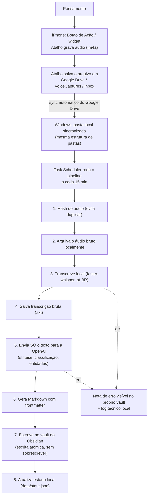

# Hellena Capturas — Arquitetura

Ferramenta pessoal de captura de pensamentos por voz no celular, com processamento
automático e chegada final no Obsidian. Documento de referência: diagnóstico,
comparação de alternativas, decisão de arquitetura, modelo de dados e plano de
implementação.

## 1. Diagnóstico

O problema não é "transcrever áudio". O problema é **atrito no momento da captura**.
Qualquer decisão exigida no instante em que a ideia surge (escolher pasta, tag,
título, revisar o texto) é suficiente para fazer o sistema ser abandonado.

O Superwhisper no computador já resolve bem o caso "estou no computador". O caso
não resolvido é: celular, sem abrir Obsidian, sem decidir nada, e o resultado
aparece sozinho depois.

Isso implica três exigências não negociáveis, na ordem de prioridade que você deu:

1. **Captura em 1–2 gestos, idealmente sem nem desbloquear o telefone.**
2. **Nenhum áudio pode se perder** — mesmo com internet instável, mesmo se o
   processamento falhar.
3. **Simplicidade** — arquivos locais e um script, não um produto.

Tudo o mais (classificação, síntese, estrutura) é secundário e acontece *depois*,
fora do momento de captura.

## 2. Alternativas avaliadas

### 2.1 Captura no celular

| Opção | Atrito real | Observação |
|---|---|---|
| **Atalho iOS (Shortcuts) + Botão de Ação / widget de tela bloqueada** | ⭐ O menor possível: 1 toque, sem desbloquear o telefone, grava e some | Só existe no iOS. Você usa iPhone → viável. |
| Telegram (bot privado) | Precisa desbloquear, abrir o app, achar a conversa, segurar o botão | Multiplataforma e robusto, mas mais lento que um Atalho |
| PWA (app web) | Precisa desbloquear e abrir o app | Exige desenvolvimento e manutenção de UI; sem ganho de atrito sobre o Atalho no iOS |
| App nativo | Igual ao PWA, com custo de desenvolvimento maior | Sem justificativa para o volume de uso pessoal |
| WhatsApp como entrada | Parecido com Telegram, mas API oficial é pesada (Business API) para uso pessoal, ou depende de automações não oficiais (frágil, contra os termos de uso) | Descartado |

**Decisão:** Atalho iOS com o Botão de Ação (ou widget de tela bloqueada em iPhones
sem Botão de Ação). Ação do Atalho: `Gravar Áudio` → `Salvar Arquivo` numa pasta
sincronizada → notificação discreta de "salvo". Sem app novo, sem manutenção de UI.

### 2.2 Transporte celular → processamento

| Opção | Confiabilidade offline | Dependência externa | Complexidade |
|---|---|---|---|
| **Pasta sincronizada (Google Drive)** | Alta — o app de sync já resolve fila/retry sozinho | Google Drive (você já usa) | Mínima: só uma pasta |
| Dropbox / Syncthing / iCloud Drive | Syncthing exige par de dispositivos sempre ativos; iCloud Drive no Windows é instável para automação | Variável | Syncthing = mais peças pra manter |
| Servidor próprio na nuvem recebendo upload | Alta, mas você precisa manter um servidor rodando | Custo + manutenção contínua | Alta — servidor, domínio, TLS |
| Telegram como transporte | Alta (servidores do Telegram) | Conta de bot no Telegram | Baixa, mas some com a vantagem do Atalho iOS |

**Decisão:** pasta local do **Google Drive Desktop** no Windows, alimentada pelo
Atalho do iPhone via app do Google Drive integrado ao Files/Shortcuts. Nenhum
servidor novo. A fila de envio/retry em rede instável já é responsabilidade do
Google Drive (celular e desktop), que é testado e mantido por terceiros — não
precisamos reinventar isso.

### 2.3 Transcrição

| Opção | Privacidade | Custo | Qualidade/velocidade |
|---|---|---|---|
| **Whisper local (faster-whisper, CPU)** | Áudio nunca sai da máquina | Zero | Boa em pt-BR com modelo `small`/`medium`; mais lento que API |
| API de transcrição (OpenAI Whisper API) | Áudio bruto (incluindo conteúdo de terapia) sai para servidor externo | ~US$0,006/min | Mais rápida e um pouco mais precisa |

**Decisão:** Whisper local. Você sinalizou que parte do conteúdo é de terapia —
isso pesa mais que a diferença de velocidade/precisão, e seu computador "quase
sempre ligado" torna a limitação de custo computacional irrelevante.

**Exceção aprovada em 2026-08-14:** áudios colocados explicitamente em
`VoiceCaptures/Reuniões` usam `gpt-4o-transcribe-diarize` na OpenAI, porque
reuniões longas precisam de menor latência e separação de falantes. Nenhuma
outra pasta usa essa exceção: terapia, ideias, reflexões e livros continuam com
Whisper local. Uma amostra curta de voz pode identificar Hellena; quando não há
correspondência segura, os falantes permanecem anônimos (`A`, `B` etc.).

### 2.4 Processamento por IA (síntese/classificação)

Aqui **só o texto já transcrito** trafega, nunca o áudio — o risco de exposição é
ordens de grandeza menor que enviar áudio bruto.

| Opção | Qualidade de síntese respeitando as regras de autoria | Dependência |
|---|---|---|
| **Claude API (Anthropic)** | Boa aderência a instruções restritivas ("não invente", "separe fala de inferência") | Chave de API paga por uso |
| OpenAI API | Equivalente em capacidade | Chave de API paga por uso |
| Modelo local (Ollama) | Modelos locais viáveis em CPU/GPU doméstica tendem a obedecer pior instruções longas e restritivas, e classificam com menos consistência | Zero custo por chamada, mas mais infraestrutura para manter |

**Decisão:** OpenAI (function calling), não Claude API. Qualidade de síntese
equivalente para este caso de uso, e a chave OpenAI já era exigida para a
transcrição de reuniões (seção 2.3) — usar o mesmo provedor nos dois pontos
elimina uma segunda chave/secret para rotacionar e manter viva. O texto
transcrito (não o áudio) continua sendo o único dado enviado. Isso está
declarado de forma explícita no `README.md` e nos comentários de configuração.

### 2.5 O que **não** foi escolhido, e por quê

- **Banco de dados:** desnecessário — o volume é de notas pessoais (dezenas por
  dia no máximo), arquivos + um índice JSON resolvem.
- **Fila/mensageria (RabbitMQ, etc.):** desnecessário — um script que roda a cada
  15 minutos e processa o que encontrar é uma fila.
- **Servidor/microserviço sempre no ar:** desnecessário — o Google Drive já é o
  "servidor" de transporte, e o Windows já fica ligado a maior parte do dia.
- **Obsidian Sync/plugin custom:** desnecessário — escrever `.md` direto na pasta
  do vault é suficiente; o Obsidian detecta o arquivo novo sozinho.

## 3. Arquitetura recomendada



Nenhum componente novo fica "sempre ligado" além do que você já usa (iPhone,
Google Drive, seu computador Windows). O único software novo é um script Python
que roda, processa o que encontrar, e termina.

## 4. Definição do MVP

O MVP entrega o caminho completo ponta a ponta com o mínimo de partes móveis:

- Captura via Atalho iOS.
- Transporte via Google Drive.
- Transcrição local (Whisper).
- Processamento via OpenAI (function calling).
- Markdown gerado e salvo no vault.
- Estado local evita duplicação e permite reprocessar.
- Erros nunca silenciosos: viram nota no vault + linha de log.

Fora do MVP (evoluções futuras, não implementadas agora):
- Busca semântica no vault existente para popular `possible_connections` de
  verdade (hoje o campo fica com os tópicos extraídos só da própria transcrição).
- App/lista de gravações recentes com player, reenvio, exclusão pela UI.
- Integração com o Content OS (a captura móvel não decide isso automaticamente —
  só sinaliza `possible_uses` incluindo "Ideia de conteúdo" quando aplicável).
- Limpeza automática de áudio antigo (a função existe no código, mas roda só
  quando você chamar — não é agendada por padrão).

## 5. Estrutura de arquivos do projeto

```
hellena-capturas/
├── ARCHITECTURE.md
├── README.md
├── requirements.txt
├── pyproject.toml
├── config.example.yaml        # copiar para config.yaml (gitignored)
├── .env.example                # copiar para .env (gitignored) — OPENAI_API_KEY
├── docs/
│   ├── ios-shortcut-setup.md
│   └── windows-setup.md
├── src/voice_capture/
│   ├── config.py               # carrega config.yaml + .env
│   ├── hashing.py               # sha256 do arquivo de áudio
│   ├── state.py                  # fila local em JSON (data/state.json)
│   ├── transcribe.py              # faster-whisper
│   ├── process_ai.py               # chamada à OpenAI + regras de autoria
│   ├── markdown_writer.py           # monta o .md e escreve no vault
│   ├── errors_note.py                # escreve falhas como nota no vault
│   ├── pipeline.py                    # orquestra um item inteiro
│   ├── cleanup.py                      # apaga áudio antigo já processado (manual)
│   └── run.py                           # ponto de entrada (CLI)
├── tests/
└── data/                        # gitignored: state.json, áudio arquivado, logs
```

## 6. Modelo de dados mínimo

Sem banco de dados. Dois lugares guardam estado:

**`data/state.json`** — índice local, chave = hash sha256 do áudio:

```json
{
  "3f9a1c...": {
    "source_filename": "Gravação 2026-07-23 22-14.m4a",
    "first_seen_at": "2026-07-23T22:16:03-03:00",
    "recorded_at": "2026-07-23T22:14:00-03:00",
    "status": "done",
    "attempts": 1,
    "error": null,
    "note_path": "Inbox/Voz/2026-07-23 2214 - vigilancia-romantizada-como-cuidado.md",
    "audio_archive_path": "data/audio_archive/3f9a1c....m4a"
  }
}
```

`status` ∈ `pending`, `transcribing`, `processing`, `done`, `error`. O hash é a
chave de deduplicação: se o mesmo arquivo chegar duas vezes (reenvio do Drive,
por exemplo), o pipeline reconhece e não gera nota duplicada.

**Frontmatter do Markdown no vault** — refinamento da sua hipótese original:

```yaml
---
type: voice-capture
id: 3f9a1c...                     # hash curto, para dedupe e rastreio
created_at: 2026-07-23T22:20:11-03:00
recorded_at: 2026-07-23T22:14:00-03:00
source: mobile-voice
processing_status: done
classification: reflexao-livro
confidence: média                 # baixa | média | alta — categórico, não um número falso-preciso
needs_review: false                # true quando confidence = baixa
related_topics: [vigilância, cuidado, relacionamentos]
possible_connections: []           # v1 não busca no vault existente — ver seção 4
audio_file: data/audio_archive/3f9a1c....m4a
transcription_model: faster-whisper-small
processing_model: gpt-4.1
---
```

Mudanças em relação à sua hipótese original, e por quê:
- `confidence` categórica (baixa/média/alta) em vez de número: um número como
  `0.73` sugere precisão que o modelo não tem. Categórico é mais honesto.
- `needs_review` derivado de `confidence`: dá pra fazer uma busca no Obsidian por
  `needs_review: true` e revisar só o que precisa, sem abrir todas as notas.
- `id`: necessário para dedupe confiável (nomes de arquivo podem colidir ou
  mudar; conteúdo, não).
- `possible_connections` existe no schema mas começa vazio — populá-lo de
  verdade exigiria indexar o vault inteiro, que é uma evolução, não o MVP.

**Corpo do Markdown** — mantém sua estrutura original, com um ajuste de nome:

```markdown
# {Título provisório}

## Síntese
{2-5 frases, fiel ao que foi dito, sem inferências disfarçadas de fato}

## Transcrição limpa
{transcrição com vícios de fala removidos (hesitações, repetições),
 sem reescrever ou trocar palavras}

## Possíveis entidades identificadas
- {pessoa, livro, personagem, conceito citado — só o que foi dito}

## Evidências e conexões
{o que a fala sugere se conectar a outras ideias — marcado como possibilidade,
 não como fato}

## Perguntas abertas
{se houver}

## Possíveis usos
- [ ] Second Brain
- [ ] Investigação
- [ ] Ideia de conteúdo
- [ ] História
- [ ] Tese
- [ ] Princípio
- [ ] Modelo mental
- [ ] Apenas arquivar

## Transcrição bruta
{texto exato saído do Whisper, sem edição}
```

(Troquei "Transcrição revisada" por "Transcrição limpa" — a IA remove vícios de
transcrição, não "revisa" no sentido editorial. Isso evita ambiguidade sobre até
onde a IA pode mexer no texto.)

## 7. Estratégia de sincronização

1. O Atalho salva o `.m4a` em `Google Drive/VoiceCaptures/inbox/` no iPhone.
2. O app do Google Drive sincroniza esse arquivo para a nuvem assim que houver
   internet (o app já enfileira e reenvia sozinho em conexão instável — não
   reimplementamos isso).
3. O Google Drive Desktop no Windows replica a mesma pasta localmente.
4. O pipeline só lê arquivos que já estão *completos* localmente (verifica que o
   tamanho do arquivo parou de crescer entre duas checagens) antes de processar,
   para não pegar um arquivo ainda sincronizando pela metade.
5. Depois de processado com sucesso, o áudio é copiado para
   `data/audio_archive/` (fora da pasta sincronizada) — a pasta `inbox` do Drive
   pode então ser esvaziada manualmente de tempos em tempos, ou você pode
   configurar limpeza automática (função `cleanup.py`, não agendada por padrão).

## 8. Estratégia de transcrição

- `faster-whisper`, modelo `small` por padrão (equilíbrio velocidade/qualidade em
  CPU comum; configurável para `medium` se a máquina aguentar e a precisão
  importar mais que a velocidade).
- Idioma fixado em `pt` (não usa autodetecção, para evitar transcrição em outro
  idioma por ruído/silêncio no início do áudio).
- Roda 100% local — nenhum áudio sai da máquina nessa etapa.
- Saída bruta salva em `data/transcripts_raw/<hash>.txt` antes de qualquer
  processamento por IA, para permitir reprocessamento futuro sem regravar.

## 9. Estratégia de processamento por IA

- Entrada: **apenas o texto** da transcrição bruta + a data/hora da gravação.
  O áudio nunca é enviado à OpenAI.
- Saída: forçada via *tool use* (function calling) da OpenAI, com um schema
  fixo — não é "peça um markdown e espere que venha certo", é um JSON validado
  que depois vira o `.md`.
- O prompt de sistema embute, quase literalmente, as regras que você definiu:
  não inventar crenças, não completar ideias não ditas, não transformar
  inferência em fato, não "melhorar" mudando o sentido, não remover
  contradições relevantes, preservar vocabulário e intenção, sinalizar
  incerteza.
- Campos que podem ficar vazios ficam vazios (ex: `entities: []`,
  `open_questions: []`) — o modelo é instruído a preferir "não identificado" a
  inventar conteúdo para preencher uma seção.

## 10. Regras para criação do Markdown

- Nome do arquivo: `YYYY-MM-DD HHmm - <slug-do-titulo-provisorio>.md`.
- Pasta única no vault (configurável, ex: `Inbox/Voz/`) — sem escolha de
  subpasta por tipo, conforme seu princípio de "nenhuma decisão editorial na
  captura". Organização por tema/pasta é decisão sua, depois, no Obsidian.
- Escrita atômica: o conteúdo é escrito primeiro em um arquivo temporário e só
  então renomeado para o nome final — evita o Obsidian indexar um `.md` pela
  metade se o processo for interrompido no meio da escrita.
- Se já existe uma nota com o mesmo `id` (hash) no `state.json`, o pipeline não
  gera outra — pula com um log de "já processado".

## 11. Tratamento de falhas e duplicação

- **Duplicação:** chave é o hash do conteúdo do áudio, não o nome do arquivo.
  Mesmo arquivo enviado duas vezes = mesma nota, sem duplicar.
- **Falha de transcrição ou de IA:** o item fica com `status: error` no
  `state.json`, com a mensagem de erro guardada. O áudio bruto e a transcrição
  (se já tiver sido gerada) **nunca são apagados** nesse caso.
- **Falha nunca é silenciosa:** toda vez que o pipeline roda e encontra erros,
  ele escreve (ou atualiza) uma nota `_Erros de captura.md` dentro do próprio
  vault, listando o que falhou e por quê — porque o Obsidian é o lugar que você
  já visita todo dia, ao contrário de um log técnico que ninguém vai abrir.
- **Reprocessamento:** `python -m voice_capture.run --reprocess <hash>` roda o
  pipeline de novo para um item específico (útil se a OpenAI teve uma saída
  ruim, por exemplo), sem precisar reenviar o áudio do zero.
- **Interrupção no meio do processo:** como cada etapa grava seu resultado
  intermediário em disco (`audio_archive` → `transcripts_raw` → `.md`), uma
  queda de energia no meio não perde trabalho já feito; a próxima execução
  retoma do ponto salvo.

## 12. Privacidade — o que sai da sua máquina, e para onde

| Dado | Vai para onde | Quando |
|---|---|---|
| Áudio bruto (.m4a) | Google Drive (armazenamento pessoal seu) | Sempre, como transporte celular→computador |
| Áudio bruto | OpenAI | Somente quando colocado deliberadamente em `VoiceCaptures/Reuniões`, para transcrição e diarização |
| Áudio bruto | **Não é enviado para API de transcrição** | Nas demais pastas (ideias, livros, reflexões e terapia) |
| Texto transcrito | OpenAI, só o texto | A cada gravação, na etapa de síntese/classificação |
| Markdown final | Só o seu vault local do Obsidian | — |

Se em algum momento você quiser eliminar até o envio de texto para a OpenAI,
a arquitetura permite trocar `process_ai.py` por um modelo local (Ollama) sem
mexer no resto do pipeline — é uma peça isolada.

## 13. Plano de implementação (etapas pequenas)

1. Estrutura do projeto + configuração (`config.py`, `.env`, `config.yaml`).
2. `state.py` + `hashing.py` — fila local, sem IA nem transcrição ainda.
3. `transcribe.py` — Whisper local isolado, testável com um áudio de exemplo.
4. `process_ai.py` — chamada à OpenAI isolada, testável com um texto fixo.
5. `markdown_writer.py` — monta e escreve o `.md`, com escrita atômica e dedupe.
6. `pipeline.py` — liga tudo, com tratamento de erro por etapa.
7. `errors_note.py` — falhas viram nota visível no vault.
8. `run.py` — CLI, ponto de entrada para o Task Scheduler.
9. Testes com as etapas de IA/transcrição mockadas (não dependem de internet nem
   de modelo baixado para rodar).
10. Documentação de instalação (Atalho iOS + Windows) e teste manual ponta a
    ponta com uma gravação real sua.

Cada etapa acima já é testável isoladamente antes de ligar a próxima — é assim
que o fluxo mínimo é provado antes de qualquer coisa "grande".
